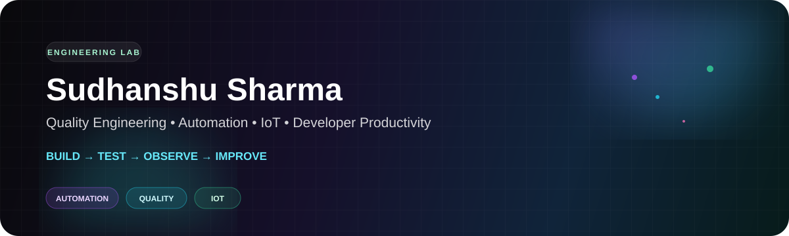

<div align="center">



<br/>

### QUALITY ENGINEERING • AUTOMATION • IOT • DEVELOPER PRODUCTIVITY

**I build systems that make software easier to trust.**

[ GitHub ](https://github.com/sharsud) · [ Projects ](#-selected-projects) · [ Engineering ](#-engineering-lab) · [ Learn with Psudo ](#-learn-with-psudo)

</div>

---

## ⚡ The short version

I'm **Sudhanshu Sharma**, a Senior QA Automation Engineer / SDET focused on building reliable automation and engineering systems.

My sweet spot is where **quality, code, infrastructure and experimentation** meet.

```text
             PRODUCT
                │
        ┌───────┴────────┐
        ▼                ▼
   ENGINEERING        QUALITY
        │                │
        └───────┬────────┘
                ▼
          AUTOMATED SIGNAL
                │
        ┌───────┴────────┐
        ▼                ▼
      INSIGHT          ACTION
        │                │
        └───────┬────────┘
                ▼
          BETTER SYSTEM
```

> **I don't optimise for the number of tests.  
> I optimise for the quality of feedback.**

---

# 🧠 Engineering DNA

<div align="center">

| 🧪 Quality | 🤖 Automation | ⚙️ Engineering | 🔌 IoT |
|:---:|:---:|:---:|:---:|
| Strategy | Playwright | CI/CD | ESP32 |
| Reliability | Selenium | Developer tooling | Arduino |
| API testing | PyTest | Git & GitHub | Wi-Fi / BLE |
| E2E | TestNG | Docker | MQTT |

</div>

### My rules of thumb

**01 — Automation is software.**  
Test code deserves architecture, reviews, observability and maintenance discipline.

**02 — Fast feedback beats massive suites.**  
A smaller signal that engineers trust is more valuable than thousands of slow tests.

**03 — Failure should teach you something.**  
A good automation system helps answer *what failed, where, why, and what changed*.

**04 — Make the boring invisible.**  
If a computer can reliably do repetitive work, let it.

**05 — Curiosity belongs in engineering.**  
Some of my favourite experiments happen outside the traditional QA toolbox.

---

# 🚀 Selected Projects

### 🔌 ESP32 LED IoT
**Hardware × Firmware × Networking**

An ESP32-based IoT experiment controlling addressable LEDs and exploring the boundary between physical devices and software automation.

→ **[ESP32_led_IOT](https://github.com/sharsud/ESP32_led_IOT)**

---

### 🎨 Drawasaur Auto Drawing
**Automation × WebSockets × Computer Interaction**

An experiment in programmatic drawing through socket-based interaction — because automation doesn't have to stay inside a test runner.

→ **[ds_socket_drawing](https://github.com/sharsud/ds_socket_drawing)**

---

### ☕ Selenium Java Frameworks
**Java × Selenium × Test Architecture**

A collection of automation framework approaches covering maintainable UI automation patterns.

→ **[Selenium-Java-multipleFw](https://github.com/sharsud/Selenium-Java-multipleFw)**

---

### 🎭 Playwright Automation
**Modern Web Testing × TypeScript / JavaScript**

A practical playground for fixtures, assertions, API testing, selectors, page objects and modern automation architecture.

→ **[PlaywrightAutomation](https://github.com/sharsud/PlaywrightAutomation)**

---

### 🐍 Selenium Python Lessons
**Learn → Build → Automate**

Practical source code for learning browser automation from fundamentals upward.

→ **[sel-python-lessons](https://github.com/sharsud/sel-python-lessons)**

---

# 🧪 Engineering Lab

I like exploring the space between **"this should work"** and **"let's actually build it."**

### 🤖 AI × Quality Engineering

Exploring practical applications of AI for:

`test generation` · `failure analysis` · `test prioritisation` · `flaky-test analysis` · `maintenance` · `developer productivity`

The goal isn't to replace engineering judgement.

**The goal is to give engineers better leverage.**

### 🔌 Software × Physical Systems

Current curiosity:

`ESP32` · `Sensors` · `LEDs` · `Wi-Fi` · `BLE` · `MQTT` · `Automation`

### 🛠️ Developer Experience

I'm interested in tools that make the correct engineering path **faster, clearer and easier to repeat**.

---

# 📈 GitHub, but self-maintained

These cards are **generated by GitHub Actions and stored inside this repository** rather than loaded from a public stats server.

That means the README doesn't depend on a third-party runtime endpoint for its statistics.

<div align="center">




</div>

<br/>

<div align="center">

<p><b>Contribution trail</b></p>

<picture>
  <source media="(prefers-color-scheme: dark)" srcset="./profile/github-snake-dark.svg">
  <source media="(prefers-color-scheme: light)" srcset="./profile/github-snake.svg">
  
</picture>

</div>

---

# 🎥 Learn with Psudo

I also create practical technical content.

**The philosophy is simple:**

> Less theory. More building.

Topics span automation, testing, programming and engineering experiments.

→ **[Learn with Psudo](https://www.youtube.com/)**

---

# 🧩 Technology Map

<details>
<summary><b>Open the toolbox</b></summary>

<br/>

**Languages**

`Python` `Java` `JavaScript` `TypeScript` `C++` `SQL` `Bash`

**Automation**

`Playwright` `Selenium` `PyTest` `TestNG` `REST APIs`

**Engineering**

`Git` `GitHub` `Docker` `VS Code` `Postman`

**CI/CD**

`GitHub Actions` `Jenkins` `Azure DevOps`

**IoT / Embedded**

`ESP32` `Arduino` `FastLED` `MQTT` `Wi-Fi` `BLE`

**Approaches**

`E2E` `API Testing` `BDD` `TDD` `Page Objects` `Continuous Testing`

</details>

---

# 🌌 What's next?

I'm deliberately building toward the intersection of:

```text
          AI
         ╱  ╲
        ╱    ╲
   QUALITY ─── AUTOMATION
        ╲    ╱
         ╲  ╱
          IoT
```

**Smarter feedback.  
Less repetitive work.  
More useful engineering.**

---

<div align="center">

### 🤝 Build something interesting?

If you're working on **quality engineering, automation, AI-assisted testing, developer productivity or IoT**, I'd love to hear about it.

**[github.com/sharsud](https://github.com/sharsud)**

<br/>

<sub>Curious by default · rigorous when it matters · automated where it makes sense.</sub>

</div>
